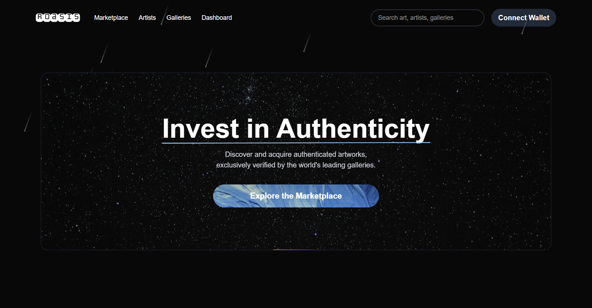
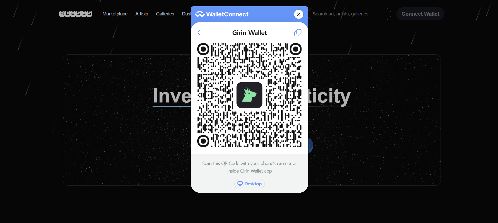
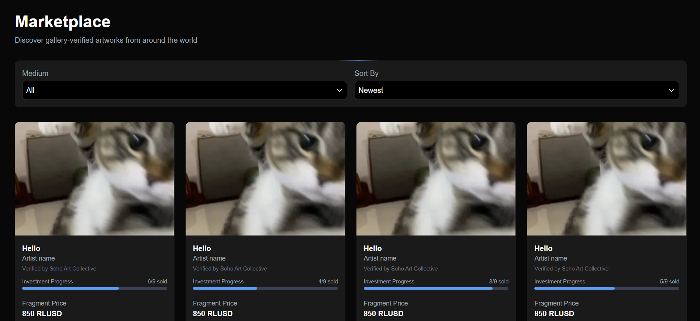
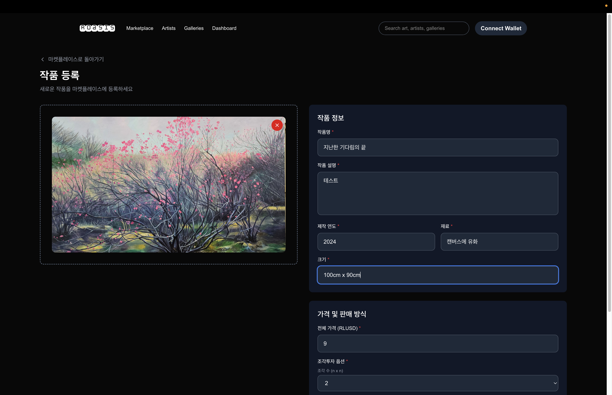
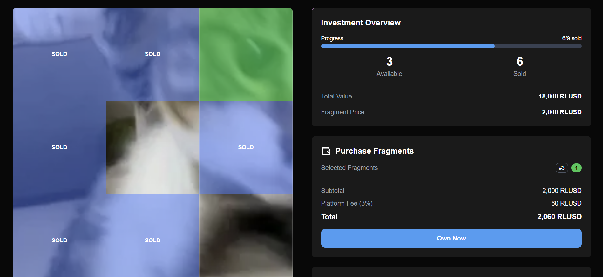

# Roasis
> **Roasis는 XRPL 기반 초저비용·고속 미술품 분할투자 플랫폼으로, 신진 작가와 투자자에게 투명한 소유권과 공정한 수익 기회를 제공합니다**



<br>

## 1) 주요 기능
- 아트워크 등록 및 관리
- 아티스트 등록 및 프로필 관리
- 갤러리 운영 및 아티스트 초대
- 사용자 대시보드 (General/Gallery)
- 지갑 연결 및 인증
- NFT 구매 및 판매

<br>

## 2) UI 스크린샷
1. 지갑 연결


2. 마켓플레이스


3. 작품 등록


5. 작품 NFT 구매


<br>

## 3) XRPL 활용 방식

### 1. Batch
**a. 사용 목적**
- 여러 개의 NFTokenCreateOffer를 한 번에 제출해 RPC 왕복/시퀀스 관리 비용 절감 및 처리량 증가

**b. 처리 전략**
- 오퍼 트랜잭션을 7개 단위 청크로 분할.
- 청크가 1개면 단건 제출(→ offer_id 추출 가능).
- 청크가 2개 이상이면 Batch로 제출(→ 개별 offer_id는 추출 어려움, batch_hash만 저장).

**c. 관련 코드**
```python
BATCH_SIZE = 7

def submit_offers_in_batches(client, wallet, classic, offer_txs):
    ...

    else:
        # 배치 제출
        batch_tx = Batch(
            account=classic,
            raw_transactions=chunk,
            flags=65536,             
        )
        batch_autofilled = autofill(batch_tx, client)
        batch_signed = sign(batch_autofilled, wallet)
        resp = submit_and_wait(batch_signed, client)
        batch_hash = resp.result.get("hash")
```

### 2. PermissionedDomain
**a. 사용 목적**
- XRPL에 Permissioned Domain을 생성해, 특정 Credential(type + issuer) 를 가진 주체만 도메인 내 오브젝트에 접근/상호작용 가능하게 설정.

**b. 처리 전략**
- Credential 생성 : credential_type = "ROASIS_GALLERY" 를 HEX(대문자)로 인코딩 / issuer = 서비스(플랫폼) 지갑 주소
- PermissionedDomainSet 트랜잭션 구성 : account = 서비스 지갑 / accepted_credentials = 위 Credential 1개 이상
- submit_and_wait 로 전송 및 검증
- 성공 시 트랜잭션 해시 및 domain_id 추출(메타에서 CreatedNode 등 파싱) 후 반환

**c. 관련 코드**
```python
def create_domain(self, domain_name: str) -> str | None:
    ...
    # Credential 구성
    cred_type_hex = "ROASIS_GALLERY".encode("utf-8").hex().upper()
    credential = Credential(
        credential_type=cred_type_hex,
        issuer=self.service_wallet.address,
    )

    # PermissionedDomainSet 트랜잭션 생성
    domain_tx = PermissionedDomainSet(
        account=self.service_wallet.address,
        accepted_credentials=[credential],
    )

```

<br>

## 4) 데모 영상
1. 주요 기능 시연 영상

2. 프로젝트 설명 데모 영상(오디오 포함)


<br>

## 5) XRPL 지갑 주소
admin : rwTxnsm6jhKXXcqfovncGstfWFbPLS9g4W


<br>

## 6) 개발 프레임워크 및 아키텍처

### 프론트 (roasis/roasis-front)
**1. 사용 스택**
- Next.js + TypeScript
- Tailwind CSS
- Zustand
- Magic UI
- XRP Wallet Integration

<br>

**2. 프로젝트 구조**
```text
roasis-front/
├── app/                    # Next.js App Router
│   ├── artists/           # 아티스트 관련 페이지
│   ├── artworks/          # 아트워크 관련 페이지
│   ├── dashboard/         # 대시보드 페이지
│   ├── galleries/         # 갤러리 관련 페이지
│   └── marketplace/       # 마켓플레이스 페이지
├── src/
│   ├── components/        # 재사용 가능한 컴포넌트
│   │   ├── artwork/       # 아트워크 관련 컴포넌트
│   │   ├── auth/          # 인증 관련 컴포넌트
│   │   ├── dashboard/     # 대시보드 컴포넌트
│   │   ├── ui/            # UI 컴포넌트
│   │   └── wallet/        # 지갑 연결 컴포넌트
│   ├── api/               # API 통신 모듈
│   ├── hooks/             # 커스텀 훅
│   ├── stores/            # 상태 관리 (Zustand)
│   └── utils/             # 유틸리티 함수
└── components.json        # UI 컴포넌트 설정
```

<br>

### 백엔드 (roasis/backend)
**1. 사용 스택**
- FastAPI(Python 3.12)
- SQLAlchemy + Alembic
- PostgreSQL
- XRPL-py
- Uvicorn + Nginx
- Docker / Docker Compose

<br>

**2. 프로젝트 구조**

```text
app/
 ├─ core/            # 환경설정, 공용 모듈
 ├─ domains/
 │   ├─ artist/      # 작가 조회 및 등록, 삭제
 │   ├─ artwork/     # 작품 조회 및 삭제
 │   ├─ auth/        # XRPL 지갑 서명 기반 인증
 │   ├─ gallery/     # 갤러리 CRUD
 │   └─ nfts/        # 작품·NFT 민팅, 트랜잭션 검증
 ├─ shared/
 │   ├─ database/           # SQLAlchemy 세션/엔진
 │   └─ pinata_client.py    # IPFS 업로드 클라이언트
 └─ main.py                 # FastAPI 엔트리포인트
 ```